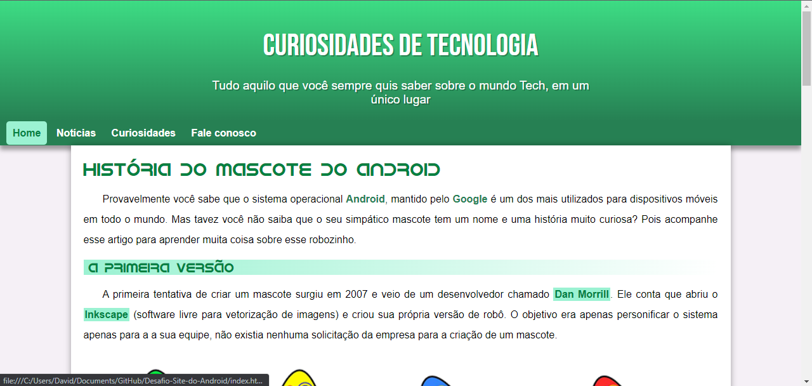

# Desafio-Site-do-Android
Criando um site para o desafio do curso em vídeo trabalhando os principais conceitos de HTML5 e CSS, trabalhando também a responsividade para que esse conteúdo possa ser visualizado em celulares e dispositivos com a tela pequena.

## Feito Com:

Copyright © DavidWillian

